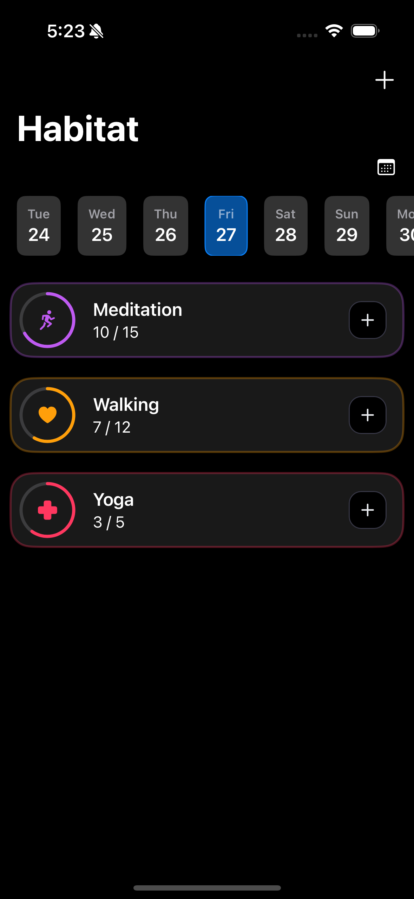
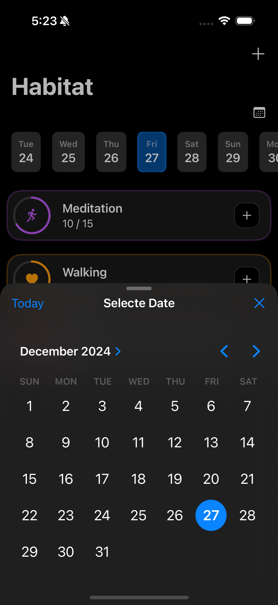
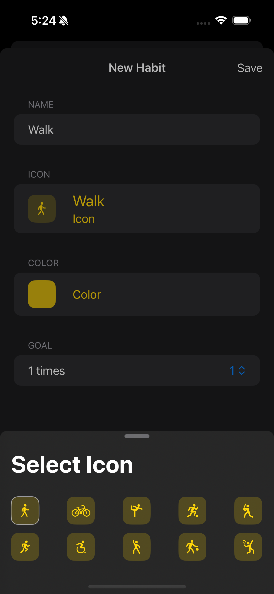

# Habitat

## Description

Habitat is a SwiftUI habit-tracking app that allows users to monitor their activities, such as learning a language or exercising. Users can add activities with titles and descriptions, view details for each activity, and track their completion counts.

## Features

- Add activities with a title and description.
- View a list of all tracked activities.
- Access detailed screens for each activity.
- Track completion counts for each activity.
- Data persistence using Codable and UserDefaults.

## Screenshots




## Getting Started

1. Clone the repository:
   ```bash
   git clone https://github.com/yourusername/Habitat.git
